- - -

# 구글 지도 플랫폼

### Google Maps Platform

* * *

**박 진 수** 교수  
Intelligent Data Semantics Lab  
Seoul National University

- - -

[credit: 김도훈(2019학번)]

<h1>Table of Contents<span class="tocSkip"></span></h1>
<div class="toc"><ul class="toc-item"><li><span><a href="#Google-Maps-Platform-시작-및-결제-계정-등록" data-toc-modified-id="Google-Maps-Platform-시작-및-결제-계정-등록-1">Google Maps Platform 시작 및 결제 계정 등록</a></span></li><li><span><a href="#Google-Maps-API-설정-및-키-발급" data-toc-modified-id="Google-Maps-API-설정-및-키-발급-2">Google Maps API 설정 및 키 발급</a></span></li><li><span><a href="#새-프로젝트-생성" data-toc-modified-id="새-프로젝트-생성-3">새 프로젝트 생성</a></span></li><li><span><a href="#Geocoding-API-사용" data-toc-modified-id="Geocoding-API-사용-4">Geocoding API 사용</a></span><ul class="toc-item"><li><span><a href="#Geocoding" data-toc-modified-id="Geocoding-4.1">Geocoding</a></span></li><li><span><a href="#Reverse-Geocoding" data-toc-modified-id="Reverse-Geocoding-4.2">Reverse Geocoding</a></span></li></ul></li></ul></div>

# Google Maps Platform 시작 및 결제 계정 등록

Google Maps Platform은 지도, 경로, 장소 관련 API 들을 제공하는 플랫폼이다. 

**(1)**  
[Google Maps Platform 홈페이지](https://cloud.google.com/maps-platform/?hl=ko)에 접속한다.
- [시작하기]를 누른다.

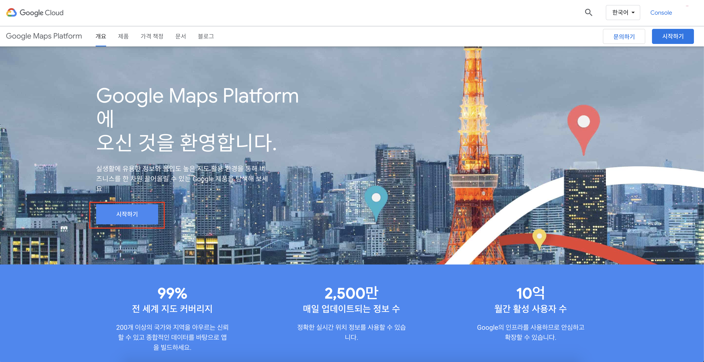

**(2)**   
Google Maps Platform을 사용하기 위해서 결제 계정을 만들어야 한다.
- 만약 본인의 구글 계정에 이미 결제 계정이 등록되어 있을 경우 그대로 사용해도 된다.
- 결제 계정을 등록한다고 해서 당장 요금이 결제가 되는 것은 아니고 자동 가입 방지를 위해 구글 측에서 요구하는 정보이므로 **12**개월의 체험판 기간 동안 무료 크레딧을 전부 사용하지 않는한 요금을 결제하지는 않는다.

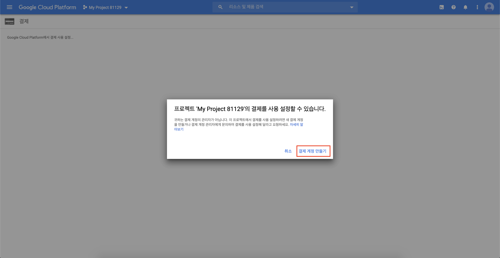

**(3)**  
본인의 개인정보와 카드 정보를 입력한다.
- 정보를 다 입력했으면 무료 평가판 시작하기를 누른다.

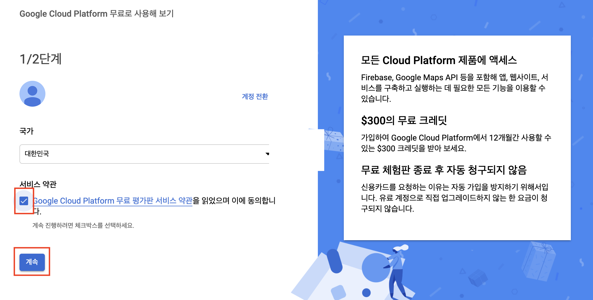

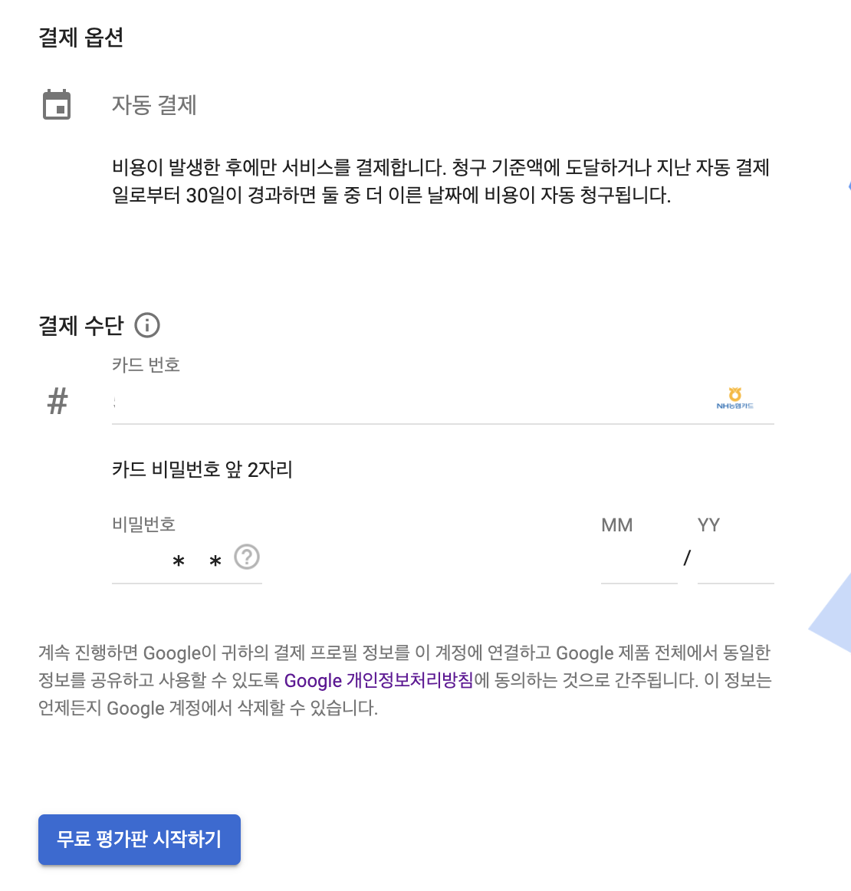

- 일반적으로는 이 과정을 통해 결제 계정 등록이 완료되지만 간혹 구글 계정을 새로 만들면 구글이 해당 계정의 사용을 강제로 정지시키는 경우가 있다. 이 때는 메일함으로 정지를 해제할 수 있는 방법에 대한 안내 메일이 오니 안내에 따라 진행하면 된다.

# Google Maps API 설정 및 키 발급

위의 과정을 모두 완료하고 무료 평가판 시작하기를 하면 다음 화면으로 이동한다.

**(4)**  
아래 화면에서 세 가지 체크박스(지도, 경로, 장소)를 모두 체크 하고 다음을 클릭한다.

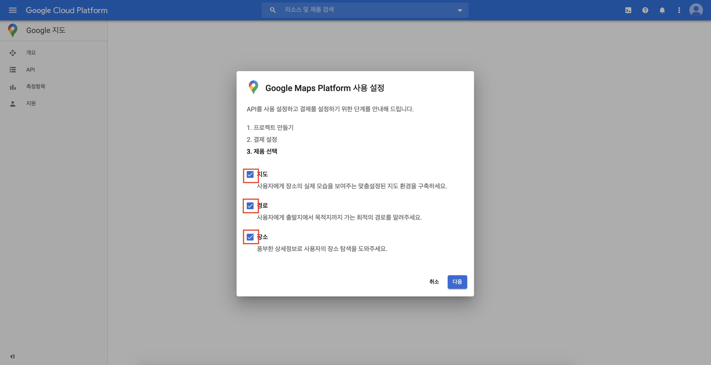

**(5)**  
지도, 경로, 장소 기능을 사용하기 위한 API가 사용 설정되고 구현을 위한 API 키가 생성된다.

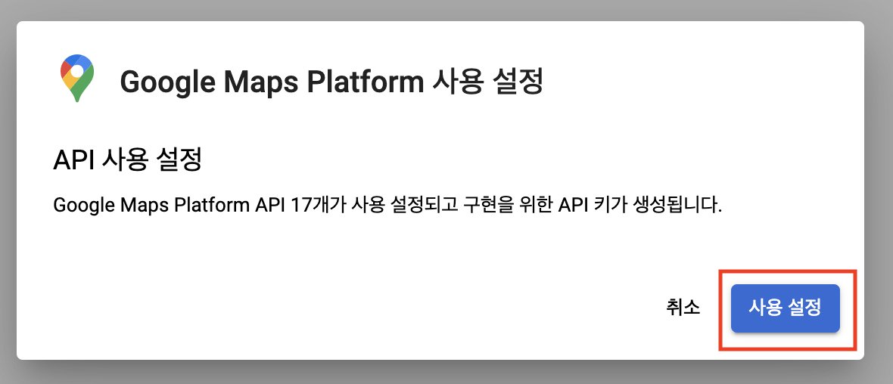

**(6)**  
이제 이 API 키를 복사하여 사용할 수 있다.

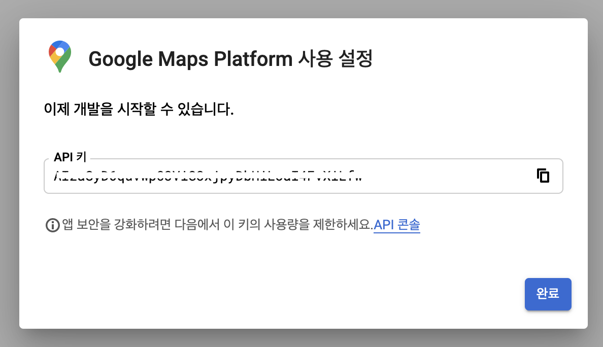

# 새 프로젝트 생성

위의 과정을 통해 지도, 경로, 장소 관련 API에 대해 사용 설정을 하고 API 키를 발급 받았다.

이번에는 새 프로젝트를 생성하고 사용하고자 하는 API를 직접 찾아서 사용 설정을 하고 키를 발급 받아 본다.

**(7)**  
화면 상단의 프로젝트 선택을 클릭하면 창이 생기는데 여기서 새 프로젝트를 클릭한다.

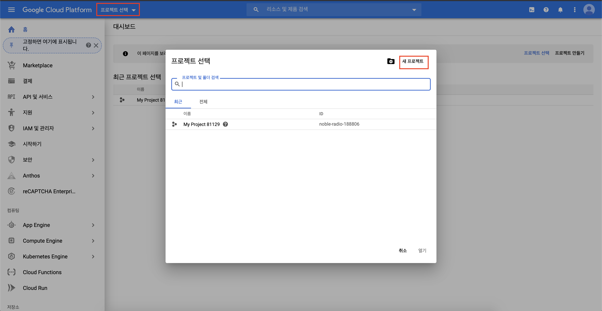

**(8)**  
프로젝트 이름을 입력하고 만들기를 클릭하여 새 프로젝트를 생성한다.

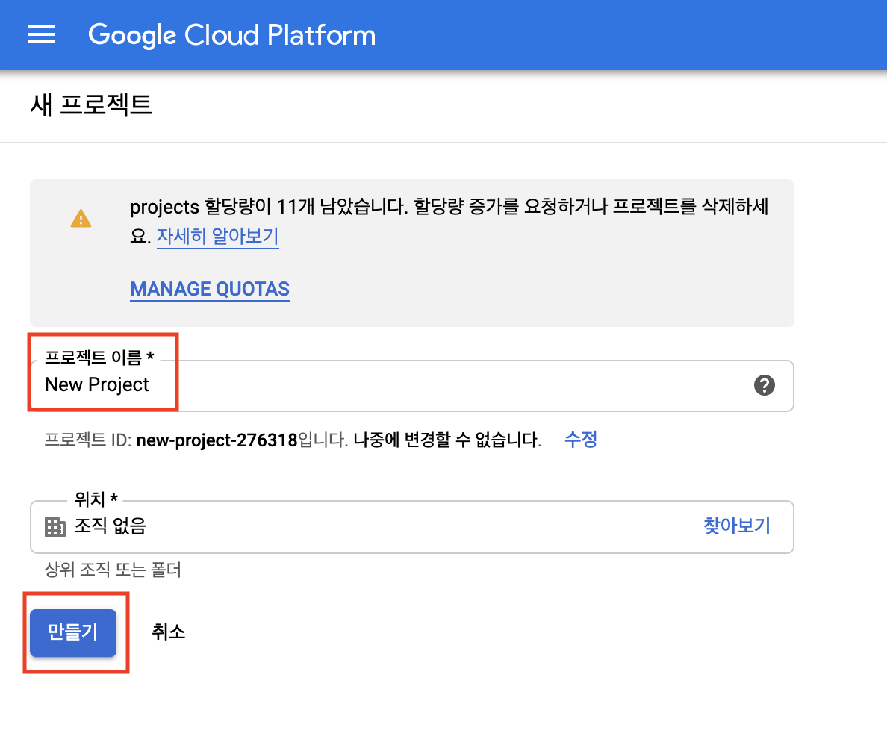

**(9)**  
새 프로젝트를 생성했으면 좌측 상단의 메뉴를 클릭하고, API 및 서비스 - 사용자 인증 정보를 클릭한다.

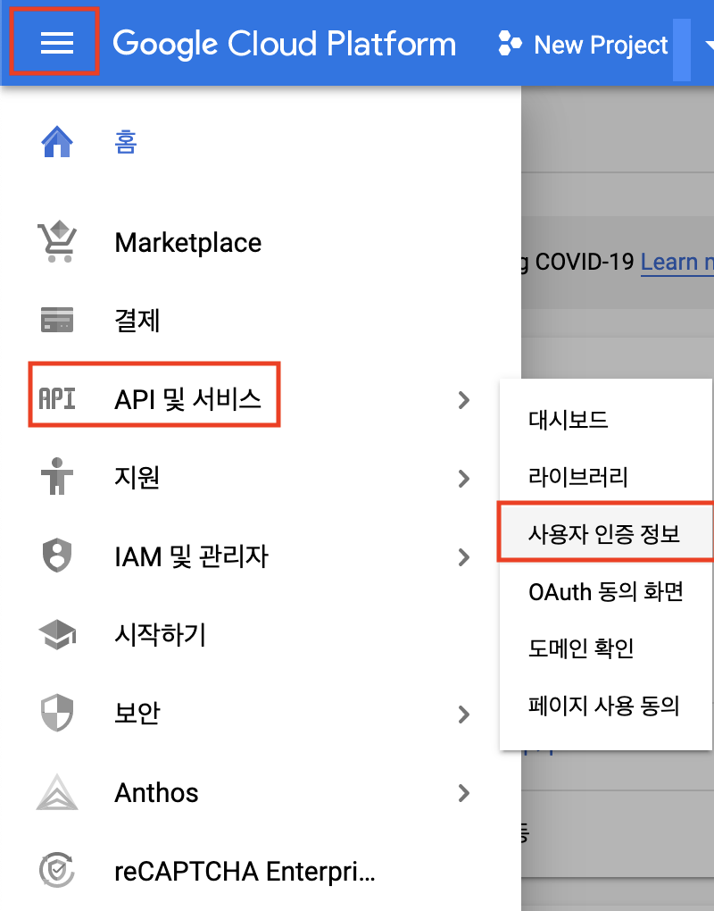

**(10)**   
사용자 인증 정보 만들기 - API 키를 클릭하여 새로운 API 키를 발급 받는다.

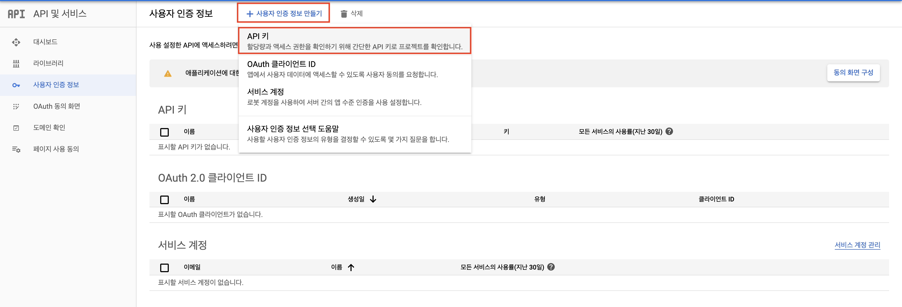
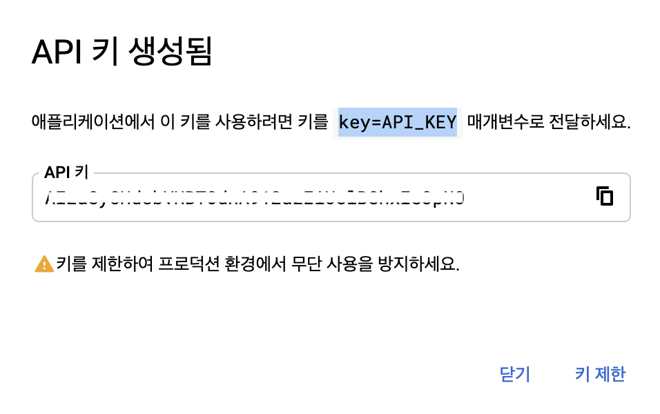

**(11)**  
이제 API를 선택하여 사용하기 위해 좌측 상단의 메뉴를 클릭하고, API 및 서비스 - 라이브러리를 클릭한다.

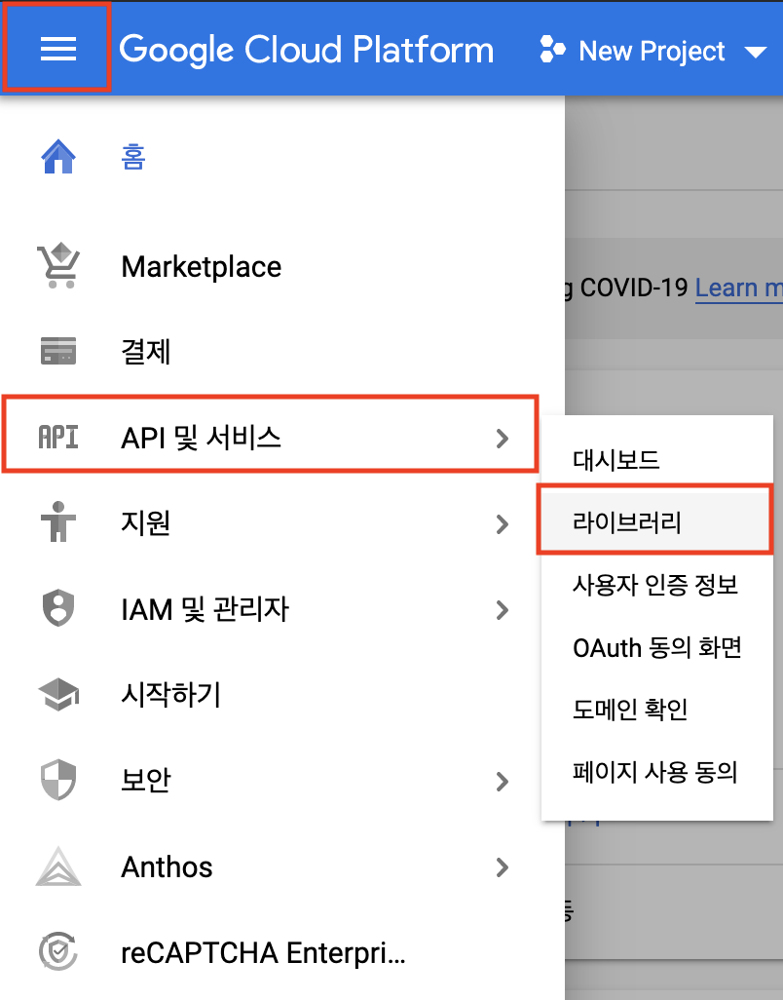

**(12)**  
API 라이브러리에서는 원하는 API를 검색할 수 있다.
- 검색창에 'geocoding'을 입력한다.

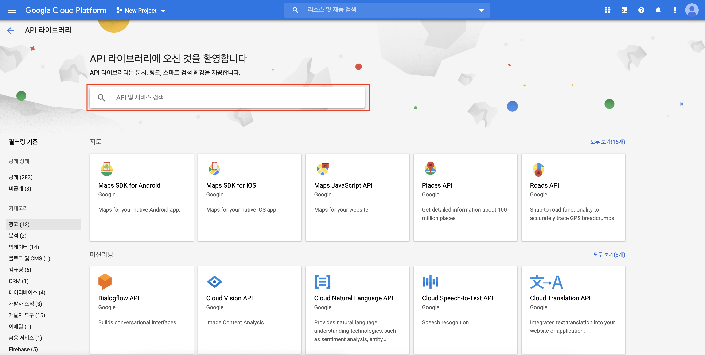

**(13)**  
검색 결과로 두 개의 API가 나오는데, 이 중 첫번째 Geocoding API를 선택한다.

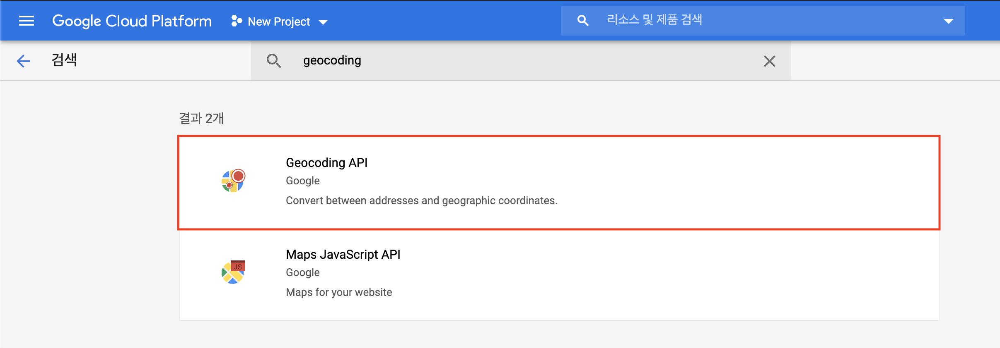

**(14)**  
사용 설정을 클릭하면 발급받은 API 키를 이용하여 Geocoding API를 사용할 수 있다.

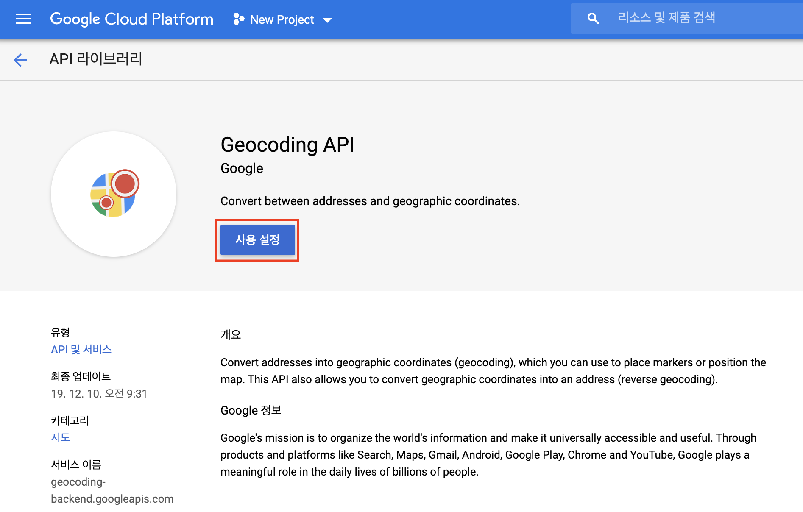

# Geocoding API 사용

Google Maps가 제공하는 다양한 API 중 주소 검색과 위도, 경보 정보를 받을 수 있는 Geocoding API를 사용해본다.

먼저 googlemaps 모듈을 설치하고 불러와야 한다.


```python
!python -m pip install googlemaps

# 또는
# !pip install googlemaps
```

    Requirement already satisfied: googlemaps in /Users/dohunkim/opt/anaconda3/lib/python3.7/site-packages (4.3.1)
    Requirement already satisfied: requests<3.0,>=2.20.0 in /Users/dohunkim/opt/anaconda3/lib/python3.7/site-packages (from googlemaps) (2.22.0)
    Requirement already satisfied: certifi>=2017.4.17 in /Users/dohunkim/opt/anaconda3/lib/python3.7/site-packages (from requests<3.0,>=2.20.0->googlemaps) (2019.9.11)
    Requirement already satisfied: idna<2.9,>=2.5 in /Users/dohunkim/opt/anaconda3/lib/python3.7/site-packages (from requests<3.0,>=2.20.0->googlemaps) (2.8)
    Requirement already satisfied: chardet<3.1.0,>=3.0.2 in /Users/dohunkim/opt/anaconda3/lib/python3.7/site-packages (from requests<3.0,>=2.20.0->googlemaps) (3.0.4)
    Requirement already satisfied: urllib3!=1.25.0,!=1.25.1,<1.26,>=1.21.1 in /Users/dohunkim/opt/anaconda3/lib/python3.7/site-packages (from requests<3.0,>=2.20.0->googlemaps) (1.24.2)


```python
import googlemaps # 설치한 googlemaps 모듈을 불러온다
```

이제 위에서 복사한 API 키를 변수에 할당하고, 해당 변수를 **gmaps = googlemaps.Client(key=)** 에 입력한다.


```python
gmaps_key = '??????????????????????????????????????'

gmaps = googlemaps.Client(key=gmaps_key)
```


## Geocoding

지오코딩(geocoding)은 주소를 이용하여 위도와 경도의 좌표값를 얻는 것을 의미한다.
- **gmaps.geocode('주소')** 로 geocoding 기능을 사용할 수 있다.

아래 예시에서는 서울대학교의 주소를 입력하여 지오코딩을 한다.


```python
gmaps.geocode('서울특별시 관악구 관악로 1')
```


    [{'access_points': [],
      'address_components': [{'long_name': '1', 'short_name': '1', 'types': []},
       {'long_name': 'Bongcheon-dong',
        'short_name': 'Bongcheon-dong',
        'types': ['political', 'sublocality', 'sublocality_level_2']},
       {'long_name': 'Seoul',
        'short_name': 'Seoul',
        'types': ['administrative_area_level_1', 'political']},
       {'long_name': 'South Korea',
        'short_name': 'KR',
        'types': ['country', 'political']},
       {'long_name': '151-050',
        'short_name': '151-050',
        'types': ['postal_code']}],
      'formatted_address': '1, Bongcheon-dong, Seoul',
      'geometry': {'location': {'lat': 37.480912, 'lng': 126.953218},
       'location_type': 'APPROXIMATE',
       'viewport': {'northeast': {'lat': 37.489766, 'lng': 126.9692254},
        'southwest': {'lat': 37.472057, 'lng': 126.9372106}}},
      'place_id': 'ChIJR_AIM4iffDURhKJ5W7kLIRY',
      'types': []}]


## Reverse Geocoding 

리버스 지오코딩(reverse geocoding)은 위도와 경도값으로부터 주소를 얻는 것을 의미한다.
- **gmaps.reverse_geocode((*위도, 경도*))** 로 reverse geocoding 기능을 사용할 수 있다.

아래 예는 제주도 특정 지역의 위도와 경도 좌표값을 입력하여 리버스 지오코딩을 한다.


```python
gmaps.reverse_geocode((33.363161, 126.529139))
```


    [{'access_points': [],
      'address_components': [{'long_name': '690-150',
        'short_name': '690-150',
        'types': ['postal_code']},
       {'long_name': 'Odeung-dong',
        'short_name': 'Odeung-dong',
        'types': ['political', 'sublocality', 'sublocality_level_2']},
       {'long_name': 'Jeju-si',
        'short_name': 'Jeju-si',
        'types': ['locality', 'political']},
       {'long_name': 'Jeju-do',
        'short_name': 'Jeju-do',
        'types': ['administrative_area_level_1', 'political']},
       {'long_name': 'South Korea',
        'short_name': 'KR',
        'types': ['country', 'political']}],
      'formatted_address': 'Odeung-dong, Jeju-si, Jeju-do, South Korea',
      'geometry': {'bounds': {'northeast': {'lat': 33.4777486, 'lng': 126.5593909},
        'southwest': {'lat': 33.3582827, 'lng': 126.5146467}},
       'location': {'lat': 33.4411967, 'lng': 126.539177},
       'location_type': 'APPROXIMATE',
       'viewport': {'northeast': {'lat': 33.4777486, 'lng': 126.5593909},
        'southwest': {'lat': 33.3582827, 'lng': 126.5146467}}},
      'place_id': 'ChIJaequWBv8DDUR42Hkzj821EQ',
      'types': ['postal_code']},
     {'access_points': [],
      'address_components': [{'long_name': 'Odeung-dong',
        'short_name': 'Odeung-dong',
        'types': ['political', 'sublocality', 'sublocality_level_2']},
       {'long_name': 'Jeju-si',
        'short_name': 'Jeju-si',
        'types': ['locality', 'political']},
       {'long_name': 'Jeju-do',
        'short_name': 'Jeju-do',
        'types': ['administrative_area_level_1', 'political']},
       {'long_name': 'South Korea',
        'short_name': 'KR',
        'types': ['country', 'political']},
       {'long_name': '690-150',
        'short_name': '690-150',
        'types': ['postal_code']}],
      'formatted_address': 'Odeung-dong, Jeju-si, Jeju-do, South Korea',
      'geometry': {'bounds': {'northeast': {'lat': 33.4777486, 'lng': 126.5593909},
        'southwest': {'lat': 33.3582827, 'lng': 126.5146467}},
       'location': {'lat': 33.4426234, 'lng': 126.537055},
       'location_type': 'APPROXIMATE',
       'viewport': {'northeast': {'lat': 33.4777486, 'lng': 126.5593909},
        'southwest': {'lat': 33.3582827, 'lng': 126.5146467}}},
      'place_id': 'ChIJaequWBv8DDUReFZ46T9Ynsc',
      'types': ['political', 'sublocality', 'sublocality_level_2']},
     {'access_points': [],
      'address_components': [{'long_name': 'Jeju-si',
        'short_name': 'Jeju-si',
        'types': ['locality', 'political']},
       {'long_name': 'Jeju-do',
        'short_name': 'Jeju-do',
        'types': ['administrative_area_level_1', 'political']},
       {'long_name': 'South Korea',
        'short_name': 'KR',
        'types': ['country', 'political']}],
      'formatted_address': 'Jeju-si, Jeju-do, South Korea',
      'geometry': {'bounds': {'northeast': {'lat': 34.053171, 'lng': 126.9979895},
        'southwest': {'lat': 33.2727985, 'lng': 126.1480697}},
       'location': {'lat': 33.4996213, 'lng': 126.5311884},
       'location_type': 'APPROXIMATE',
       'viewport': {'northeast': {'lat': 34.053171, 'lng': 126.9979895},
        'southwest': {'lat': 33.2727985, 'lng': 126.1480697}}},
      'place_id': 'ChIJ_XltioXgDDUR4pyR4WmImks',
      'types': ['locality', 'political']},
     {'access_points': [],
      'address_components': [{'long_name': 'Jeju-do',
        'short_name': 'Jeju-do',
        'types': ['administrative_area_level_1', 'political']},
       {'long_name': 'South Korea',
        'short_name': 'KR',
        'types': ['country', 'political']}],
      'formatted_address': 'Jeju-do, South Korea',
      'geometry': {'bounds': {'northeast': {'lat': 34.053171, 'lng': 126.9979895},
        'southwest': {'lat': 33.1032777, 'lng': 126.1480697}},
       'location': {'lat': 33.4890113, 'lng': 126.4983023},
       'location_type': 'APPROXIMATE',
       'viewport': {'northeast': {'lat': 34.053171, 'lng': 126.9979895},
        'southwest': {'lat': 33.1032777, 'lng': 126.1480697}}},
      'place_id': 'ChIJRUDITFTjDDURMb8emNI2vGY',
      'types': ['administrative_area_level_1', 'political']},
     {'access_points': [],
      'address_components': [{'long_name': 'South Korea',
        'short_name': 'KR',
        'types': ['country', 'political']}],
      'formatted_address': 'South Korea',
      'geometry': {'bounds': {'northeast': {'lat': 38.63400000000001,
         'lng': 131.1603},
        'southwest': {'lat': 33.0041, 'lng': 124.5863}},
       'location': {'lat': 35.907757, 'lng': 127.766922},
       'location_type': 'APPROXIMATE',
       'viewport': {'northeast': {'lat': 38.63400000000001, 'lng': 131.1603},
        'southwest': {'lat': 33.0041, 'lng': 124.5863}}},
      'place_id': 'ChIJm7oRy-tVZDURS9uIugCbJJE',
      'types': ['country', 'political']}]


- - -

# THE END
